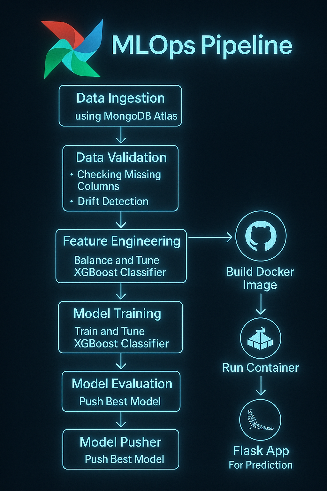
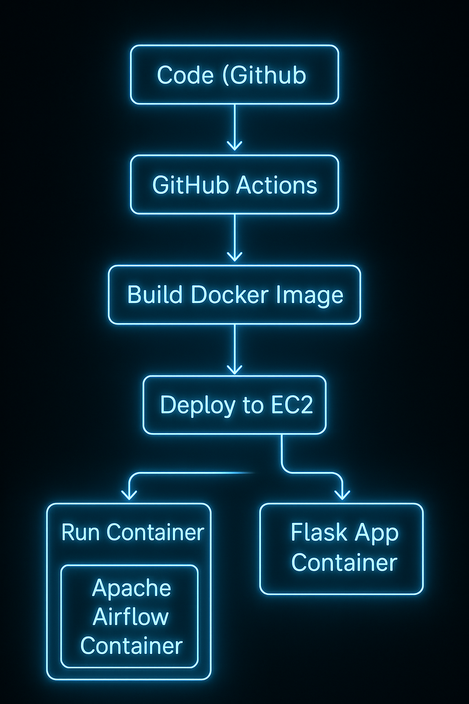

<!-- Centered Title Banner -->
<p align="center">
  
</p>

<p align="center">
  
  
  
  
  
  
</p>

---


<p align="center">
  
</p>

<p align="center">
  
</p>

---

## 📂 Project Navigation  

📁 [**Notebooks**](notebook/) | 📁 [**Pipelines**](src/pipeline/) | 📁 [**Components**](src/components) | 📁 [**Project Details**](project_details/) | 📁 [**Documents**](project_details/documents/)

### 📌 Project Overview

- **Python Version**: 3.12  
- Detecting **fraudulent card transactions** using machine learning techniques to enhance the security of online and ATM transactions for banks.
- The system:
  - Logs experiments using **MLflow**
  - Automates training with **Apache Airflow**
  - Fetches the **latest trained model** from **AWS S3**
  - Supports **continuous learning**
  - Deployed via **AWS Cloud Services**

---

## 💁️ Project Structure

```

Fraud-Transaction-Detection/
│
|── dataset/                                   # 📂 Contains Project Dataset
|
|── templates/                                 # 📂 Contains HTML files for the app's structure
|   └── predict.html
|
|── static/                                    # 📂 Contains CSS files for styling the app
|   └── style.css
|
├── project_details/                           # 📂 Contains Project info and reports
|   └── documents/                             # 📖 Project Reports(HLD, LLD,DPR ,etc.)
|
├── .dockerignore                              # 🚫 Ignore files for Docker
├── .env                                       # 🔑 Environment variables
├── .gitignore                                 # 🚫 Ignore files for Git
│
|── demo/
|   ├── project_demo.mp4                       # Full Project Explaination
│   └── assets/                                # Gif and Images 
| 
├── .github/
│   └── workflows/
│       └── main.yaml                          # ⚙️ GitHub Actions CI/CD pipeline
│
├── airflow/                                   # 💨 Apache Airflow DAGs
│   └── dags/                                  # 📅 Workflow DAGs
│       ├── batch_prediction_pipeline.py       # 🔍 Airflow DAG for prediction
│       └── training_pipeline.py               # 🎯 Airflow DAG for model training
│
├── start.sh                                   #  Initialize the Airflow database
|                                 
├── artifact/                                  # 🐂 Contains all intermediate and final outputs
├── predictions/                               # 📂 Predictions processed files
├── data_dump.py                               # 🛋️ Dumps data into MongoDB Atlas
├── docker-compose.yml                         # 🔧 Docker Compose for multi-container setup
├── Dockerfile                                 # 💪 Docker image setup
│
├── LICENSE                                    # 📚 MIT License file
├── main.py                                    # 🚀 Entry point for training and predictions
├── notebook/                                  # 📚 Jupyter notebooks
│   ├── research.ipynb                         # 🔄 Exploratory Data Analysis and Model Training
│   
│
├── README.md                                  # 📖 Project documentation
├── requirements.txt                           # 📌 Dependencies for the project
├── saved_models/                              # 🎯 Production-ready models and transformers
├── setup.py                                   # ⚙️ Package setup for `src`
|
├── src/
│   ├── components/                            # 🏢 Core pipeline components
│   │   ├── data_ingestion.py                  # 📅 Handles data collection
│   │   ├── data_transformation.py             # 🔄 Prepares data for training
│   │   ├── feature_engineering.py             # 🔄 Generate new features for training
|   |   |── data_validation.py                 # ✅ Validates raw data
│   │   ├── model_evaluation.py                # 📊 Evaluates the model
│   │   ├── model_pusher.py                    # 🚀 Pushes the trained model to deployment
│   │   ├── model_training.py                  # 🎓 Trains the machine learning model
│   │
│   ├── config.py                              # ⚙️ Configuration management and environment variables
│   ├── entity/                                # 📆 Data structures for pipeline
│   │   ├── artifact_entity.py                 # 🐂 Artifacts generated by pipeline stages
│   │   └── config_entity.py                   # ⚙️ Configuration-related entities
│   │
│   ├── exceptions.py                          # ❗ Custom exception handling
│   ├── logger.py                              # 💜 Logging setup
│   ├── pipeline/                              # 🔄 Pipeline automation
│   │   ├── batch_prediction_pipeline.py       # 🔍 Handles batch predictions
│   │   └── training_pipeline.py               # 🎯 Automates training workflow
│   │
│   └── utils.py                               # 🛠️ Utility functions
```

## 🚀 Connect with Me

<p align="center">

  <a href="https://github.com/Rajatsingh64" target="_blank">
    
  </a>
  &nbsp;&nbsp;
  <a href="https://www.linkedin.com/in/rajat-singh-292124240" target="_blank">
    
  </a>
  &nbsp;&nbsp;
  <a href="mailto:rajat.k.singh64@gmail.com">
    
  </a>

</p>

<p align="center">
  💻 Developed by <strong>Rajat Singh</strong> | ⚡ Powered by Passion & Code  
</p>

<p align="center">
  
</p>
